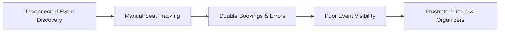
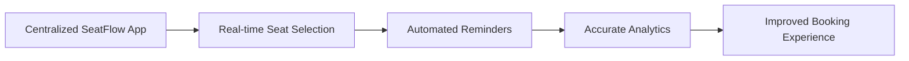

# SeatFlow - Problem Statement

## Problem Context
Four major user groups are affected by fragmented event management:

| Segment | Typical Context | Core Frictions |
|---|---|---|
| Guests / Visitors | Browsing upcoming events, comparing availability | Difficulty deciding whether to register without clear availability |
| Registered Users / Customers | Securing preferred seats, tracking history | Risk of double booking, managing reservations |
| Event Organizers | Creating events, monitoring bookings | Lack of dedicated tools to manage seat capacity and view performance |
| Administrators | Overseeing users, events, and categories | Lack of a centralized system to oversee booking issues and platform analytics |

## Current State (As-Is)
1. Guests and users lack a reliable way to browse events and compare availability.
2. Customers face the risk of double booking when trying to secure preferred seats.
3. Event organizers require dedicated tools to manage seat capacity and monitor overall event performance.
4. Administrators lack a centralized system to oversee users, booking issues, and platform analytics.

## Future State (To-Be)

1. Unified event ecosystem with clear event discovery tools for searching and filtering by category, date, venue, and price.
2. Reliable seat selection interface that displays availability, shows categories like VIP, and prevents double booking.
3. Automated notification service for booking confirmations, event updates, and pre-event reminders.
4. Comprehensive analytics dashboard tracking total bookings, seats sold versus available, and cancellation rates.

## Business Impact

| Impact Area | Current Cost | Expected Benefit |
| --- | --- | --- |
| Seat allocation | High risk of double booking | Customers can confidently select preferred seats with double booking prevention |
| Event oversight | Poor tracking of event performance | Organizers equipped with analytics to track seats sold vs available |
| Communication | Missed updates or manual follow-ups | Improved communication through automated confirmations and reminders |
| Administration | Decentralized user and event handling | Efficient oversight of attendee lists and booking windows |

## Problem Statement

Guests, customers, event organizers, and administrators lack a centralized and reliable system for event and seat management. This causes risks like double booking, poor visibility into seat availability, and inefficient event monitoring. SeatFlow addresses this by providing a unified, RESTful API-driven web application with secure real-time seat selection, automated notifications, and comprehensive analytics dashboards.

