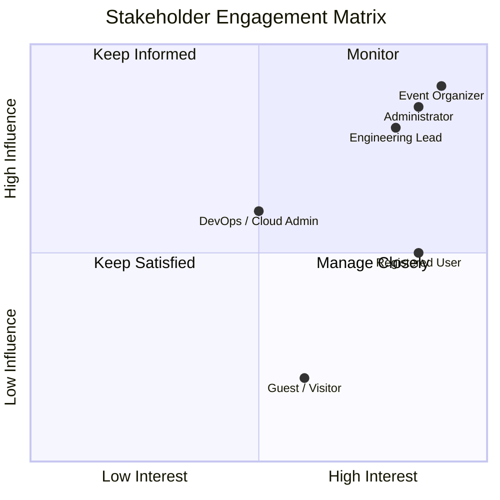

markdown
# SeatFlow - Stakeholder Analysis

## Stakeholder Categories

### Primary Stakeholders
| Stakeholder | Role | Key Expectation |
|---|---|---|
| Registered User / Customer | [cite_start]Book seats, manage reservations, receive reminders, and track booking history[cite: 8]. | [cite_start]Reliable seat selection that prevents double booking [cite: 27][cite_start], with prompt booking confirmations and event reminders[cite: 35, 36]. |
| Event Organizer | [cite_start]Create events, manage seating, monitor bookings, and view event performance[cite: 9]. | [cite_start]Accurate tracking of seats sold vs seats available, and control over opening/closing booking windows[cite: 41, 47]. |
| Guest / Visitor | [cite_start]Browse events, compare availability, and decide whether to register[cite: 7]. | [cite_start]Easy event discovery through keyword searches, sorting by popularity, and filtering by category, date, venue, and price[cite: 21, 22, 23]. |

### Secondary Stakeholders
| Stakeholder | Role | Key Expectation |
|---|---|---|
| Administrator | [cite_start]Oversee users, events, categories, booking issues, and platform analytics[cite: 10]. | [cite_start]Centralized oversight using a comprehensive analytics dashboard and secure JWT-secured sessions[cite: 16, 39]. |
| University Instructors / Reviewers | [cite_start]Evaluate the system as a university project[cite: 5]. | [cite_start]Delivery of a functional MVP with a simple and maintainable code structure[cite: 12, 64]. |

### Internal Stakeholders
[cite_start]Engineering (FastAPI & React TypeScript developers) [cite: 2][cite_start], QA, DevOps (Dockerized AWS Deployment)[cite: 2], Product Management.

### External Stakeholders
[cite_start]Cloud Provider (AWS/DynamoDB) [cite: 62][cite_start], University reviewers/auditors[cite: 5].

## Stakeholder Influence-Interest Matrix
| Stakeholder | Influence | Interest |
|---|---|---|
| Event Organizer | High | High |
| Administrator | High | High |
| Engineering Lead | High | High |
| Registered User / Customer | Medium | High |
| University Instructors / Reviewers | High | Medium |
| DevOps / Cloud Admin | Medium | Medium |
| Guest / Visitor | Low | Medium |

## Engagement Strategy

## RACI Matrix

| Deliverable | Event Organizer | Administrator | Architect | Engineering | QA | DevOps | University Reviewers |
| --- | --- | --- | --- | --- | --- | --- | --- |
| MVP Scope & Requirements | C | A | R | C | C | I | C |
| Web Architecture Design | I | C | A | R | C | C | I |
| RESTful API Design | I | I | A | R | C | I | I |
| Implementation (FastAPI/React) | I | I | C | A/R | C | C | I |
| Database Design (DynamoDB) | I | I | A | R | C | I | I |
| Test Plan & Cases | C | C | C | C | A/R | I | I |
| Dockerized Deployment | I | I | C | I | R | A/R | I |
| Project Signoff & Evaluation | I | C | C | C | C | C | A/R |

**Legend:** R = Responsible, A = Accountable, C = Consulted, I = Informed.