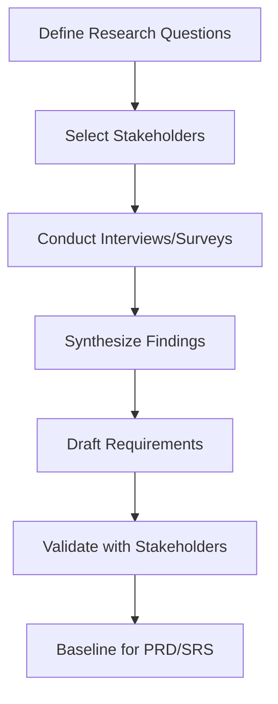

# SeatFlow - Information Gathering Report

## Why Information Gathering Is Necessary
Requirement quality determines delivery quality. Without disciplined elicitation, teams ship features that are technically correct but operationally misaligned. [cite_start]This phase reduced ambiguity regarding seating logic, concurrency control, and role permissions, establishing a shared, testable scope for the web application[cite: 4, 5].

## Requirement Elicitation Goals
| Goal ID | Goal |
|---|---|
| EG-01 | Identify root friction points in event discovery and seat selection processes |
| EG-02 | Convert organizer and user needs into measurable requirements (FR/NFR) |
| EG-03 | [cite_start]Validate feasibility and constraints early (e.g., handling concurrency with NoSQL/DynamoDB) [cite: 62] |
| EG-04 | [cite_start]Build traceable artifacts for engineering and university academic review [cite: 64] |

## Methodology Used
| Method | Target Group | Purpose | Output |
|---|---|---|---|
| Interviews | Event organizers, frequent attendees, administrators | [cite_start]Deep qualitative insights on booking friction and management [cite: 9, 10] | Persona pain maps, candidate stories |
| Surveys | University students and staff | Quantitative prioritization | Feature demand and severity ranking |
| Observation | Simulated booking and management sessions | Workflow behavior validation | Process bottlenecks in seat selection |
| Document Analysis | Existing booking platforms and MVP rubrics | Gap and best-practice comparison | Baseline capability matrix |

## Elicitation Process

## Key Findings

| Finding ID | Finding | Requirement Implication |
| --- | --- | --- |
| IF-01 | Users express extreme frustration when a selected seat is booked by someone else during checkout. | FR-024..FR-028 (Prevent double booking) |
| IF-02 | Event organizers lack visibility into real-time seat availability, ticket sales, and cancellation trends. | FR-039..FR-044 (Analytics Dashboard) |
| IF-03 | Attendees frequently forget upcoming events without automated pre-event notifications. | FR-034..FR-038 (Reminder & Notification Service) |
| IF-04 | Complex navigation deters guests from registering; event discovery needs powerful search and filtering. | FR-019..FR-023 (Search, filter, sort) |
| IF-05 | The system must be accessible on both desktop and mobile screens seamlessly for on-the-go booking. | NFR-001 (Responsive UI) |

## Requirement Themes

1. **Concurrency & Reliability:** Strict seat locking to prevent double booking and secure JWT authentication for session handling.

2. **Discoverability:** Quick event search and filtering by category, date, venue, and price.

3. **Operational Visibility:** Comprehensive dashboards for organizers and admins to track total bookings, seats sold, and upcoming trends.

4. **Proactive Communication:** Reliable booking confirmations, cancellation notices, and pre-event reminders.

## Outcome

The elicitation output became the baseline for PRD, user stories, FR/NFR, use cases, SRS, design, and QA traceability.

