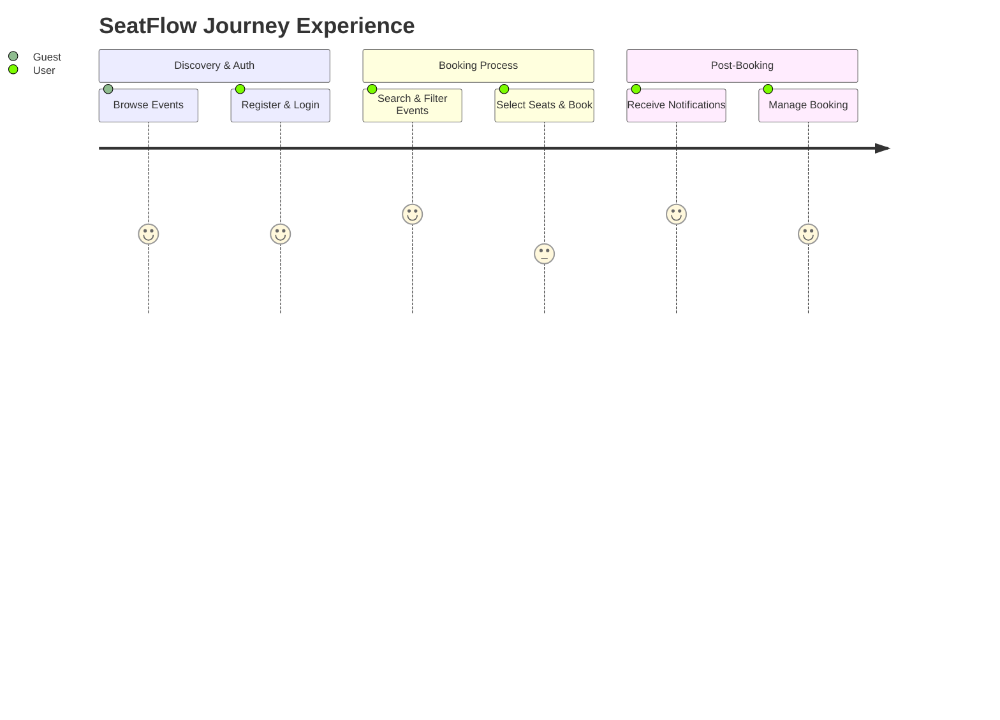

# SeatFlow - User Journey Map

## Journey Stages
Browse Events -> Register & Login -> Search & Filter Events -> Select Seats & Book -> Receive Notifications -> Manage Booking

## End-to-End Journey Table
| Stage | User Goal | User Actions | System Response | Pain Risk | Improvement Opportunities | Linked Modules |
|---|---|---|---|---|---|---|
| Browse Events | Discover events[cite: 1] | Visit the site and browse upcoming events[cite: 1] | Display event catalog | Hard to find specific events | Implement intuitive event listings prior to requiring authentication[cite: 1] | Event Module[cite: 1] |
| Register & Login | Create an account securely[cite: 1] | Register and log in securely[cite: 1] | Create user, issue JWT-secured session[cite: 1] | Authentication friction | Clear password reset flow and profile view/update management[cite: 1] | Auth & User Module[cite: 1] |
| Search & Filter Events | Find targeted events[cite: 1] | Search by keyword, filter by category/date/venue/price, and sort[cite: 1] | Return sorted and filtered event list[cite: 1] | Overwhelming event lists | Robust sorting by popularity, date, or availability[cite: 1] | Event Module[cite: 1] |
| Select Seats & Book | Secure preferred seats[cite: 2] | Select seats (including VIP/Standard categories) and confirm booking[cite: 1] | Store booking, strictly prevent double booking[cite: 1] | Seat conflict during checkout | Strict real-time seat locking mechanism to ensure accurate availability[cite: 1] | Seat & Booking Module[cite: 1] |
| Receive Notifications | Stay informed about the event[cite: 2] | Receive booking confirmation and pre-event reminder[cite: 1] | Dispatch automated notifications[cite: 1] | Missing event due to forgotten dates | Reliable delivery of event updates and reminders before the scheduled date[cite: 1] | Notification Module[cite: 1] |
| Manage Booking | Track or modify reservations[cite: 2] | Review booking history and cancel if necessary[cite: 1] | Update booking status (Pending, Confirmed, Cancelled, Expired)[cite: 1] | Difficulty tracking reservation status | Centralized booking dashboard for clear, real-time status tracking[cite: 1] | Booking Module[cite: 1] |

## Experience Heatmap

## Key Journey Improvements

1. Eliminate the risk of double booking during the seat selection phase to build user trust.

2. Enhance the initial guest discovery experience by offering powerful search, filtering (category, date, venue, price), and sorting capabilities.

3. Ensure the high reliability of automated communications, specifically booking confirmations, cancellations, and reminders before the event.

