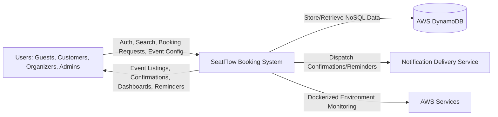
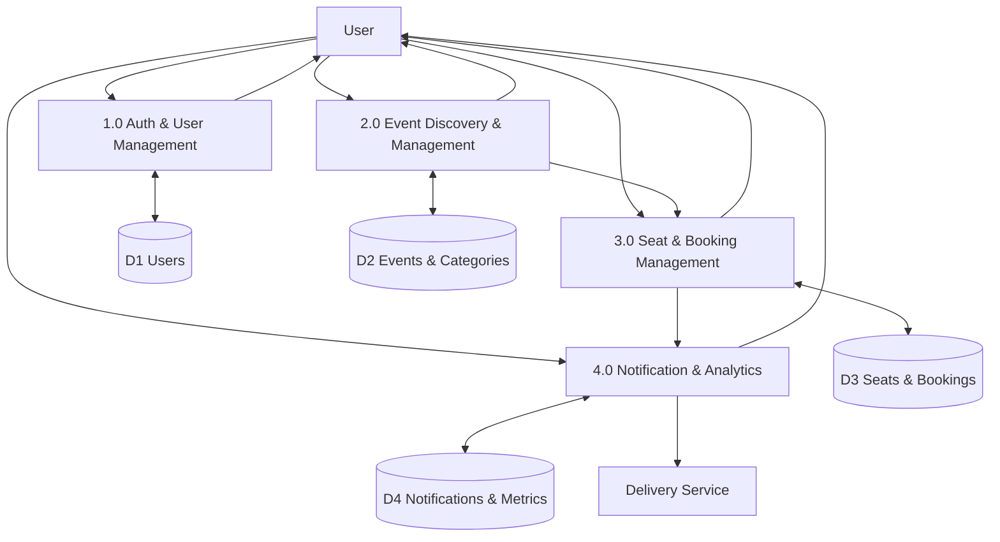

# SeatFlow - Data Flow Diagrams (DFD)

## Context Diagram

```mermaid
flowchart LR
    U[Users: Guests, Customers, Organizers, Admins] -->|Auth, Search, Booking Requests, Event Config| S[SeatFlow Booking System]
    S -->|Event Listings, Confirmations, Dashboards, Reminders| U
    S -->|Store/Retrieve NoSQL Data| DB[(AWS DynamoDB)]
    S -->|Dispatch Confirmations/Reminders| ES[Notification Delivery Service]
    S -->|Dockerized Environment Monitoring| AWS[AWS Services]

```

## Level 0 DFD

```mermaid
flowchart TD
    U[User]
    P1[1.0 Auth & User Management]
    P2[2.0 Event Discovery & Management]
    P3[3.0 Seat & Booking Management]
    P4[4.0 Notification & Analytics]
    D1[(D1 Users)]
    D2[(D2 Events & Categories)]
    D3[(D3 Seats & Bookings)]
    D4[(D4 Notifications & Metrics)]
    E1[Delivery Service]

    U --> P1
    U --> P2
    U --> P3
    U --> P4

    P1 <--> D1
    P2 <--> D2
    P3 <--> D3
    P4 <--> D4

    P3 --> P4
    P2 --> P3
    P4 --> E1
    P4 --> U
    P3 --> U
    P2 --> U
    P1 --> U

```

## Level 1 DFD - Process Decomposition

```mermaid
flowchart TD
    subgraph UM[1.0 User Management]
        UM1[1.1 Register User]
        UM2[1.2 Authenticate & Issue JWT]
        UM3[1.3 Password Reset Flow]
        UM4[1.4 Profile & Role Management]
    end

    subgraph EM[2.0 Event Management]
        EM1[2.1 Create/Update/Delete Event]
        EM2[2.2 Search, Filter & Sort Catalog]
        EM3[2.3 Set Capacity & Categories]
        EM4[2.4 Open/Close Booking Windows]
    end

    subgraph BM[3.0 Seat & Booking Management]
        BM1[3.1 Display Available Seats]
        BM2[3.2 Lock Seats Prevent Double Booking]
        BM3[3.3 Create/Cancel Booking]
        BM4[3.4 Track Status & History]
    end

    subgraph NA[4.0 Notification & Analytics]
        NA1[4.1 Trigger Confirmations/Reminders]
        NA2[4.2 Dispatch Event Updates/Cancellations]
        NA3[4.3 Calculate Seats Sold vs Available]
        NA4[4.4 Aggregate Dashboard Metrics]
    end

    DBU[(Users)]:::db
    DBE[(Events & Categories)]:::db
    DBB[(Seats & Bookings)]:::db
    DBN[(Notifications/Logs)]:::db
    EP[Delivery Service]

    UM1 --> DBU
    UM2 --> DBU
    UM3 --> DBU
    UM4 --> DBU
    
    EM1 --> DBE
    EM2 --> DBE
    EM3 --> DBE
    EM4 --> DBE
    
    BM1 --> DBE
    BM1 --> DBB
    BM2 --> DBB
    BM3 --> DBB
    BM4 --> DBB
    
    NA1 --> DBN
    NA2 --> DBN
    NA1 --> EP
    NA2 --> EP
    NA3 --> DBB
    NA3 --> DBE
    NA4 --> DBB
    NA4 --> DBN

    classDef db fill:#f2f2f2,stroke:#777,stroke-width:1px;

```

