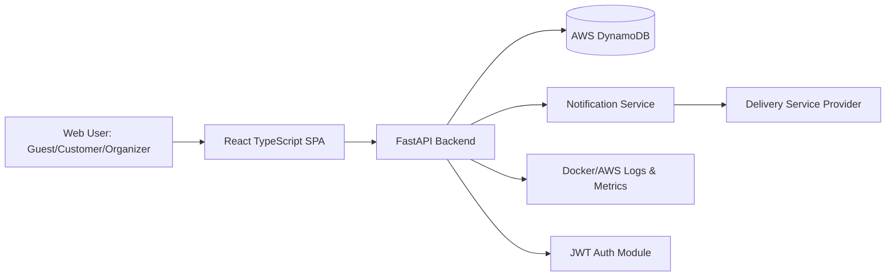
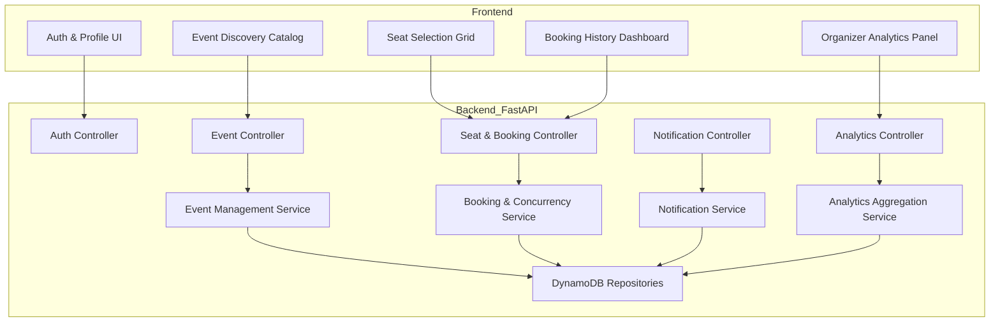
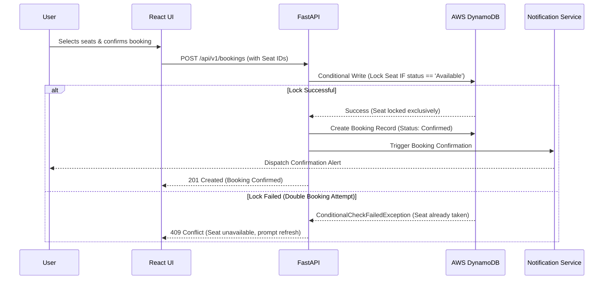
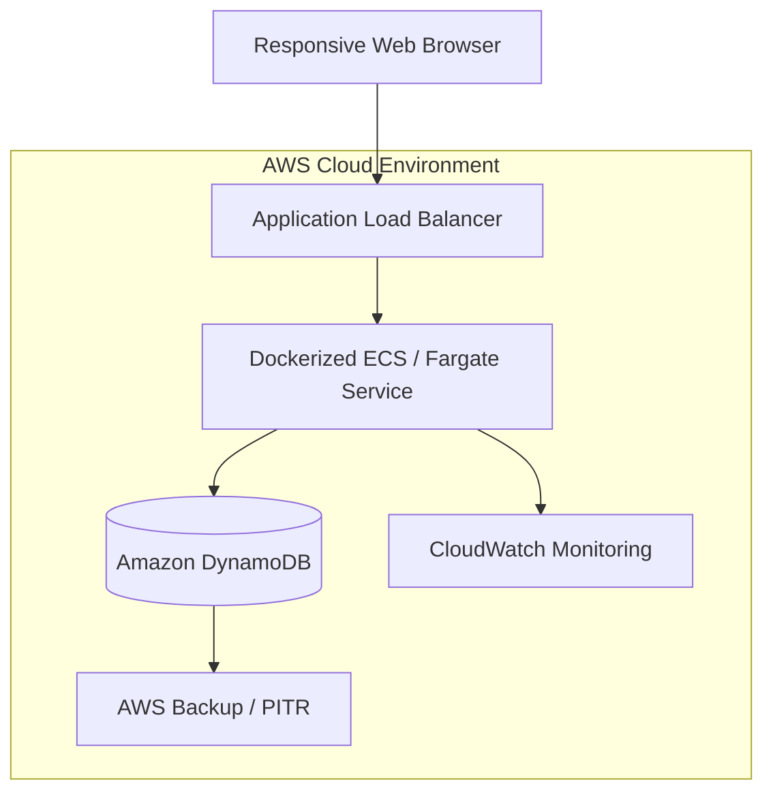

# SeatFlow - System Design

## High-Level Design
SeatFlow follows a layered, API-first architecture designed strictly for a web-based MVP environment without external hardware dependencies:
1. **Presentation Layer:** React (TypeScript) SPA delivering a fully responsive UI for desktop and mobile browsers.
2. **Application Layer:** FastAPI backend handling core business logic, including JWT authentication, event discovery, seating concurrency, notifications, and analytics.
3. **Data Layer:** AWS DynamoDB (NoSQL) utilizing conditional writes to enforce strict seat-locking and prevent double booking.
4. **Platform Layer:** Dockerized application deployment on AWS ensuring reproducible, consistent environments for execution and academic review.

## Architecture Diagram

## Component Diagram

## Data Flow

*The following sequence illustrates the critical concurrency flow designed to prevent double booking during checkout.*

## Security Architecture

| Layer | Control |
| --- | --- |
| Identity | JWT-secured sessions (access/refresh tokens) and secure password reset flow |
| API | Route-level authorization and Role-Based Access Control (Customer vs. Organizer vs. Admin) |
| Data | Encryption in transit (TLS 1.2+), hashed passwords, NoSQL table isolation |
| Audit | Tracking of booking transactions, cancellations, and capacity modifications |
| Platform | Environment variables managed via Docker secrets, restricted AWS IAM roles for DynamoDB access |

## Deployment Architecture

