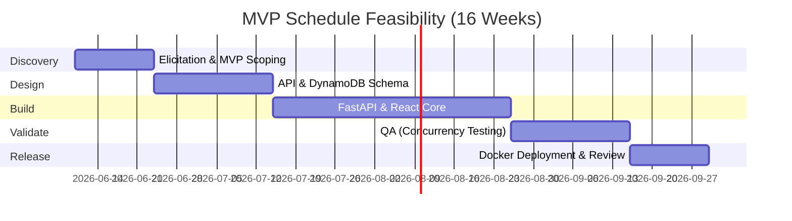

# SeatFlow - Feasibility Analysis

## Feasibility Summary
| Dimension | Status | Conclusion |
|---|---|---|
| Technical | Feasible | Chosen modern stack fully supports responsive web requirements and concurrency control without complex hardware. |
| Economic | Feasible | Positive ROI achievable within a university project or startup MVP budget model. |
| Operational | Feasible | Organizers and admins are provided dedicated tools for straightforward oversight. |
| Legal | Feasible | Scope intentionally excludes payment gateways, bypassing PCI-DSS requirements. |
| Schedule | Feasible | 16-week timeline fits a standard university project scope. |
| Risk | Manageable | High-risk features (IoT, hardware, native mobile apps) are explicitly excluded from the MVP. |

## Technical Feasibility
- **Frontend:** React (TypeScript) ensures type safety, a modular UI, and fully responsive web design for both desktop and mobile screens (no native mobile app required).
- **Backend:** Python FastAPI provides high-performance RESTful APIs to efficiently handle event discovery and booking logic.
- **Database:** AWS DynamoDB (NoSQL) offers scalable data persistence and is well-suited for implementing fast seat-locking mechanisms to prevent double booking.
- **Auth:** JWT-secured authentication allows for stateless scaling and secure session management for all user types.
- **Deployment:** Dockerized AWS deployment ensures a consistent environment across development, testing, and production.

## Economic Feasibility
*Note: Estimates reflect a hypothetical university grant or seed-stage MVP budget rather than enterprise commercial scale.*

### Cost Estimate (MVP Phase)
| Cost Component | Estimated Cost (USD) |
|---|---|
| Development (Stipends/Labor equivalence) | 15,000 |
| Cloud infrastructure (AWS DynamoDB, Compute) | 1,200 |
| Tooling/Monitoring | 500 |
| Contingency (10%) | 1,670 |
| **Total** | **18,370** |

### Benefit Estimate (Year 1 Post-Launch)
| Benefit Component | Estimated Value (USD) |
|---|---|
| Administrative time saved (organizer automation) | 20,000 |
| Reduction in manual double-booking resolution | 5,000 |
| Centralized platform usage value (department/campus) | 10,000 |
| **Total** | **35,000** |

**Net Benefit:** 16,630 USD (positive ROI).

## Operational Feasibility
| Area | Readiness | Notes |
|---|---|---|
| Product/Engineering workflow | High | Clear MVP scope defined; out-of-scope items (IoT, payments) are strictly documented. |
| Organizer readiness | High | Dedicated organizer panel included for capacity and attendee list management. |
| Deployment & Maintenance | High | Dockerization guarantees simple hand-offs and consistent environments for university reviewers. |

## Legal Feasibility
1. **Payments:** Payment gateways are intentionally out of scope for the MVP, eliminating immediate PCI-DSS compliance burdens.
2. **Data Privacy:** User data handling (registration, profiles) must align with university privacy guidelines and standard consent requirements.
3. **Security:** JWT authentication and password reset flows establish a secure baseline for user access.

## Schedule Feasibility

## Cost-Benefit Analysis

| Metric | Value |
| --- | --- |
| Total Cost | 18,370 USD |
| Total Benefit | 35,000 USD |
| Net Benefit | 16,630 USD |
| ROI | 90.5% |
| Payback Period | ~6.3 months |

## Risk Feasibility

| Risk Category | Feasibility Concern | Mitigation |
| --- | --- | --- |
| Technical | Seat double-booking during high traffic | Implement strict concurrency controls and conditional writes in DynamoDB. |
| Scope | Pressure to add payment or hardware integration | Strictly enforce the MVP boundary (no IoT, no external hardware, no payments). |
| Security | JWT token misuse | Implement short-lived access tokens and secure password reset flows. |
| Operational | Organizers failing to manage event capacity | Provide an intuitive Analytics Dashboard tracking seats sold vs. available. |

## Conclusion

The SeatFlow MVP is feasible across technical, economic, operational, and schedule dimensions. By intentionally scoping out IoT, real-time hardware, and payment gateways, the project mitigates primary technical risks and perfectly aligns with a university project timeline and budget constraints.
