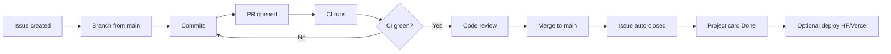

# Seat-Flow — GitHub Professional Workflow

Professional process for planning, developing, reviewing, and shipping the Seat-Flow MVP.

**Stack:** Frontend → Vercel (React + TypeScript) · API → Hugging Face Space (FastAPI + Docker) · DB/Auth → Supabase

---

## Table of contents

1. [Current status](#1-current-status)
2. [Issue count overview](#2-issue-count-overview)
3. [Planning and tracking](#3-planning-and-tracking--projects--issues)
4. [Development and proposal](#4-development-and-proposal--branching--prs)
5. [Linking work](#5-linking-work--issue-keywords)
6. [Automated quality assurance](#6-automated-quality-assurance--github-actions)
7. [Review, merge, and closure](#7-review-merge-and-closure--full-integration)
8. [This week’s checklist](#8-this-weeks-checklist)
9. [Do not do](#9-do-not-do)
10. [Quick reference](#10-quick-reference)

---

## 1. Current status

| Area | Status |
|------|--------|
| Phase 0–1 (tools, accounts, `/health`, env) | Done locally |
| GitHub Issues (open, MVP-aligned) | None yet |
| CI workflows (`.github/workflows/*`) | Empty stubs |
| Frontend | UI prototype exists; not audited against API/MVP |
| Backend | Health/bootstrap only; domain features not built |

**Important:** Files under `project_issues/` still describe **AWS Lambda + DynamoDB**. That stack is **out of scope** for this MVP. Treat those files as historical notes and create a **new** issue set aligned to Vercel + Hugging Face + Supabase.

Do not invent frontend bug issues yet. Start with an **audit** issue; open real bugs only after gaps are confirmed.

---

## 2. Issue count overview

Create **18 issues** for the MVP board.

| Kind | Purpose | Count |
|------|---------|------:|
| Closed / done (Phase 0–1) | Document completed work | 2 |
| Process / QA | CI + workflow rules | 2 |
| Product / feature | MVP delivery | 13 |
| Hardening | Deploy smoke + release checklist | 1 |
| **Total** | | **18** |

Optional later: split large issues (for example Auth) into smaller ones — up to ~25. Start with **18**.

---

## 3. Planning and tracking — Projects & Issues

### 3.1 Create a GitHub Project

1. Open the repo → **Projects** → **New project** → **Board**
2. Name: `Seat-Flow MVP`
3. Columns:

   `Backlog` → `Ready` → `In Progress` → `In Review` → `Done`

4. Optional custom fields:

   - **Priority:** P0 / P1 / P2  
   - **Area:** frontend / backend / infra / docs  
   - **Phase:** Foundation / Core / Ops  

### 3.2 Labels (create once)

```text
type:feature | type:bug | type:chore | type:docs | type:ci
area:frontend | area:backend | area:db | area:auth | area:infra
priority:P0 | priority:P1 | priority:P2
phase:foundation | phase:core | phase:ops
status:blocked
```

### 3.3 The 18 issues

Create them in order. Move Phase 0–1 issues to **Done** and close them immediately.

#### A. Already done (create, then close)

| ID | Title | Labels |
|----|-------|--------|
| #1 | `[Done] Phase 0–1: Local prerequisites and free cloud accounts` | `type:chore`, `phase:foundation` |
| #2 | `[Done] Phase 0–1: Backend/frontend env bootstrap and /health smoke` | `type:chore`, `area:backend`, `area:frontend` |

**Body for each:** short description + acceptance checklist (Node / Python / Docker; Supabase / HF / Vercel accounts; `/health`; `.env.example`; Docker on port 7860).

**Close comment:**

```text
Completed on phase1 branch before GitHub tracking.
```

#### B. Process / QA (do next, before features)

| ID | Title | Labels |
|----|-------|--------|
| #3 | `chore(ci): implement GitHub Actions for frontend and backend` | `type:ci`, `priority:P0` |
| #4 | `docs: CONTRIBUTING — branch naming, PR template, issue linking` | `type:docs`, `priority:P0` |

#### C. Product backlog (MVP order)

| ID | Title | Labels | Depends on |
|----|-------|--------|------------|
| #5 | `chore: frontend MVP audit — inventory screens, mock data, gaps vs API` | `area:frontend`, `priority:P0` | — |
| #6 | `db: Supabase schema — users/roles, events, seats, bookings` | `area:db`, `priority:P0` | — |
| #7 | `feat(auth): Supabase Auth + FastAPI JWT validation + RBAC` | `area:auth`, `priority:P0` | #6 |
| #8 | `feat(api): OpenAPI contract for events, seats, bookings` | `area:backend`, `priority:P0` | #6 |
| #9 | `feat(frontend): app shell, routing, role-aware navigation` | `area:frontend`, `priority:P0` | #5 |
| #10 | `feat: event discovery — browse, search, filter, sort` | `type:feature`, `priority:P0` | #8, #9 |
| #11 | `feat: seat selection + double-booking prevention` | `type:feature`, `priority:P0` | #6, #8 |
| #12 | `feat: booking lifecycle — create, history, cancel, status` | `type:feature`, `priority:P0` | #11 |
| #13 | `feat: notifications — confirm, cancel, reminder, update` | `type:feature`, `priority:P1` | #12 |
| #14 | `feat: organizer panel — event CRUD, capacity, booking window` | `type:feature`, `priority:P1` | #10, #12 |
| #15 | `feat: analytics dashboard — bookings, occupancy, cancellations` | `type:feature`, `priority:P1` | #12 |
| #16 | `feat: admin — categories, users oversight, booking issues` | `type:feature`, `priority:P2` | #14 |
| #17 | `test: Vitest + Pytest baseline for critical paths` | `type:chore`, `priority:P1` | #3, #12 |
| #18 | `chore(deploy): Vercel + HF Space smoke + CORS + Auth redirects` | `area:infra`, `priority:P1` | #7, #12 |

### 3.4 Issue body template

Use this template for every new issue:

```markdown
## Summary
One paragraph: what and why.

## Scope
- In:
- Out:

## Tasks
- [ ] ...
- [ ] ...

## Acceptance criteria
- [ ] ...
- [ ] ...

## Stack notes
Frontend: Vercel (React + TS)
API: Hugging Face Space (FastAPI + Docker)
DB/Auth: Supabase

## Links
Blocks: #
Blocked by: #
```

### 3.5 Frontend “unknown problems”

Do **not** open random bug issues yet.

1. Open **#5** (frontend audit).
2. On a branch, list routes/screens and mark each: `mock` / `partial` / `missing` / `broken`.
3. From the audit, open **bug issues only for real defects**  
   (example: `#19 fix: seat map double-select`).

---

## 4. Development and proposal — Branching & PRs

### 4.1 Branch rules

| Branch | Purpose |
|--------|---------|
| `main` | Always deployable; protected |
| `develop` | Optional integration branch; student teams may skip and PR → `main` |
| `feature/#N-short-name` | One issue = one branch |
| `fix/#N-short-name` | Bugfix |
| `chore/#N-short-name` | CI / docs / infra |

**Examples:**

```text
feature/7-supabase-auth-jwt
feature/11-seat-selection
chore/3-github-actions-ci
fix/19-seat-map-double-select
```

### 4.2 One-issue workflow

```text
1. Move issue → Ready → In Progress
2. git checkout main && git pull
3. git checkout -b feature/12-booking-lifecycle
4. Implement + commit (small commits)
5. Push branch
6. Open PR → main
7. CI must pass
8. Review → merge
9. Issue auto-closes → move card to Done
```

### 4.3 PR title style

```text
feat(bookings): create/cancel booking API and history UI (#12)
fix(frontend): prevent double seat selection (#19)
chore(ci): add frontend lint and backend pytest (#3)
```

### 4.4 Protect `main`

Repo **Settings → Branches**:

- Require a pull request before merging
- Require status checks (after #3 exists): frontend CI, backend CI
- Require 1 review if the team has multiple members; solo still use PRs for history

---

## 5. Linking work — Issue keywords

Put keywords in the **PR description** (not only in commits):

| Keyword | Effect |
|---------|--------|
| `Closes #12` | Merge closes the issue |
| `Fixes #19` | Same for bugs |
| `Resolves #7` | Same |
| `Refs #5` | Links without closing |

### PR body template

```markdown
## Summary
- ...

## Test plan
- [ ] ...
- [ ] ...

Closes #12
```

One PR should usually close **one** issue.  
Use `Closes #10, Closes #11` only when both issues are fully complete in that PR.

---

## 6. Automated quality assurance — GitHub Actions

Workflow files under `.github/workflows/` are currently **empty**. Issue **#3** fills them.

### 6.1 Minimum CI (before heavy features)

**`.github/workflows/ci-frontend.yml`**

- Trigger: PR and push to `main` when `frontend/**` changes
- Steps: `npm ci` → `npm run lint` → `npm run build` → `npm test` (when tests exist)

**`.github/workflows/ci-backend.yml`**

- Trigger: PR and push when `backend/**` changes
- Steps: install deps → optional lint (`ruff` / `flake8`) → `pytest`

### 6.2 Deploy workflows

- Leave staging/production **manual or deferred** until #18
- Do not enable auto-deploy on empty YAML stubs

### 6.3 Quality gate

No merge to `main` while CI is red.

---

## 7. Review, merge, and closure — Full integration



### 7.1 Merge checklist (every PR)

1. Linked with `Closes #N`
2. CI green
3. Acceptance criteria on the issue checked off
4. No secrets (`.env` never committed)
5. Prefer squash merge (one clear commit per issue on `main`)

### 7.2 After merge

- Confirm the issue is closed
- Confirm the Project card is in **Done**
- Delete the remote branch
- Pull `main` before starting the next issue

---

## 8. This week’s checklist

1. Create Project board + labels  
2. Create issues **#1–#18** (close #1–#2)  
3. Implement **#3** (CI) and **#4** (CONTRIBUTING) via PRs  
4. Complete **#5** frontend audit → open real bug issues only if needed  
5. Deliver **#6 → #7 → #8 → #9** (schema, auth, API, shell)  
6. Deliver core booking path **#10 → #11 → #12**  
7. Deliver **#13–#18**

---

## 9. Do not do

- Recreate the old DynamoDB / Lambda issues as-is  
- Put all MVP work into one giant issue  
- Commit straight to `main` without PRs  
- Open dozens of speculative frontend bugs before the audit  

---

## 10. Quick reference

| Question | Answer |
|----------|--------|
| How many issues? | **18** to start |
| First open work? | **#3 CI**, **#4 docs**, **#5 FE audit**, **#6 schema** |
| Frontend bugs? | Unknown → **audit first**, then bug issues |
| Old `project_issues/`? | Outdated stack → use the issue list in this document |
)
