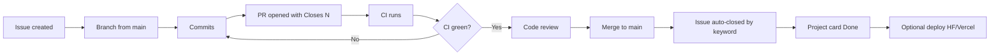

# Seat-Flow — GitHub Professional Workflow

Professional process for planning, developing, reviewing, and shipping the Seat-Flow MVP.

**Stack:** Frontend → Vercel (React + TypeScript) · API → Hugging Face Space (FastAPI + Docker) · DB/Auth → Supabase

Also see root [CONTRIBUTING.md](../../CONTRIBUTING.md) (branching + **required** GitHub keywords).

---

## Table of contents

1. [Current status](#1-current-status)
2. [Issue map (real GitHub numbers)](#2-issue-map-real-github-numbers)
3. [Planning and tracking](#3-planning-and-tracking--projects--issues)
4. [Development and proposal](#4-development-and-proposal--branching--prs)
5. [Linking work — GitHub keywords (required)](#5-linking-work--github-keywords-required)
6. [Automated quality assurance](#6-automated-quality-assurance--github-actions)
7. [Review, merge, and closure](#7-review-merge-and-closure--full-integration)
8. [All remaining steps (ordered)](#8-all-remaining-steps-ordered)
9. [Do not do](#9-do-not-do)
10. [Quick reference](#10-quick-reference)

---

## 1. Current status

| Area | Status |
|------|--------|
| Phase 0–1 (tools, accounts, `/health`, env) | Done — tracked as closed [#35](https://github.com/galibhasan720/Seat-Flow/issues/35), [#36](https://github.com/galibhasan720/Seat-Flow/issues/36) |
| Labels + 18 MVP issues | Done (#35–#52) |
| GitHub Project board | Create `Seat-Flow MVP` and add #35–#52 |
| CI workflows | Implement via PR: `Closes #37` |
| CONTRIBUTING + PR template | Implement via PR: `Closes #38` |
| Frontend | UI prototype; audit via [#39](https://github.com/galibhasan720/Seat-Flow/issues/39) |
| Backend | Health/bootstrap; features via #40–#52 |

**Important:** Files under `project_issues/` still describe **AWS Lambda + DynamoDB**. Out of scope for this MVP. Use issues **#35–#52** instead.

---

## 2. Issue map (real GitHub numbers)

Repo already had older issues, so the MVP set is **#35–#52** (not #1–#18).

| Step | Issue | Title | Status |
|-----:|------:|-------|--------|
| 1 | [#35](https://github.com/galibhasan720/Seat-Flow/issues/35) | Phase 0–1 prerequisites | Closed |
| 2 | [#36](https://github.com/galibhasan720/Seat-Flow/issues/36) | Phase 0–1 env bootstrap | Closed |
| 3 | [#37](https://github.com/galibhasan720/Seat-Flow/issues/37) | GitHub Actions CI | Open |
| 4 | [#38](https://github.com/galibhasan720/Seat-Flow/issues/38) | CONTRIBUTING + keywords | Open |
| 5 | [#39](https://github.com/galibhasan720/Seat-Flow/issues/39) | Frontend MVP audit | Open |
| 6 | [#40](https://github.com/galibhasan720/Seat-Flow/issues/40) | Supabase schema | Open |
| 7 | [#41](https://github.com/galibhasan720/Seat-Flow/issues/41) | Auth + JWT + RBAC | Open |
| 8 | [#42](https://github.com/galibhasan720/Seat-Flow/issues/42) | OpenAPI contract | Open |
| 9 | [#43](https://github.com/galibhasan720/Seat-Flow/issues/43) | App shell / routing | Open |
| 10 | [#44](https://github.com/galibhasan720/Seat-Flow/issues/44) | Event discovery | Open |
| 11 | [#45](https://github.com/galibhasan720/Seat-Flow/issues/45) | Seat selection | Open |
| 12 | [#46](https://github.com/galibhasan720/Seat-Flow/issues/46) | Booking lifecycle | Open |
| 13 | [#47](https://github.com/galibhasan720/Seat-Flow/issues/47) | Notifications | Open |
| 14 | [#48](https://github.com/galibhasan720/Seat-Flow/issues/48) | Organizer panel | Open |
| 15 | [#49](https://github.com/galibhasan720/Seat-Flow/issues/49) | Analytics | Open |
| 16 | [#50](https://github.com/galibhasan720/Seat-Flow/issues/50) | Admin | Open |
| 17 | [#51](https://github.com/galibhasan720/Seat-Flow/issues/51) | Vitest + Pytest | Open |
| 18 | [#52](https://github.com/galibhasan720/Seat-Flow/issues/52) | Deploy smoke | Open |

---

## 3. Planning and tracking — Projects & Issues

### 3.1 Create a GitHub Project

1. Repo → **Projects** → **New project** → **Board**
2. Name: `Seat-Flow MVP`
3. Columns: `Backlog` → `Ready` → `In Progress` → `In Review` → `Done`
4. Add issues #35–#52
5. Place #35–#36 in **Done**; #37–#40 in **Ready**; #41–#52 in **Backlog**

### 3.2 Labels (already created)

`type:*` · `area:*` · `priority:P0|P1|P2` · `phase:*` · `status:blocked`

### 3.3 Issue body template

```markdown
## Summary
One paragraph: what and why.

## Scope
- In:
- Out:

## Tasks
- [ ] ...

## Acceptance criteria
- [ ] ...

## Stack notes
Frontend: Vercel (React + TS)
API: Hugging Face Space (FastAPI + Docker)
DB/Auth: Supabase

## Links
Blocks: #
Blocked by: #
```

---

## 4. Development and proposal — Branching & PRs

| Branch | Purpose |
|--------|---------|
| `main` | Always deployable; protected |
| `feature/<issue>-short-name` | One issue = one branch |
| `fix/<issue>-short-name` | Bugfix |
| `chore/<issue>-short-name` | CI / docs / infra |

```text
chore/37-github-actions-ci
chore/38-contributing-keywords
feature/40-supabase-schema
```

### One-issue workflow

```text
1. Move issue → Ready → In Progress
2. git checkout main && git pull
3. git checkout -b feature/46-booking-lifecycle
4. Implement + commit
5. Push branch
6. Open PR → main with keyword in PR body
7. CI must pass
8. Review → merge
9. Issue auto-closes via keyword → card → Done
```

---

## 5. Linking work — GitHub keywords (required)

GitHub uses automation keywords in **pull request descriptions** and **commit messages** to dynamically link PRs to issues and **automatically close** them when merged. This removes the need to manually mark issues resolved after merge.

### Closing keywords

| Keyword forms | Example in PR body |
|---------------|--------------------|
| `Closes` / `Close` / `Closed` | `Closes #37` |
| `Fixes` / `Fix` / `Fixed` | `Fixes #55` |
| `Resolves` / `Resolve` / `Resolved` | `Resolves #40` |

### Reference only (does not close)

```text
Refs #39
```

### Where to put them

1. **Required:** PR description (most reliable).  
2. **Optional:** commit message body.  
3. Prefer **one** `Closes #N` per PR unless multiple issues are fully done.

### PR body template (must include keyword)

```markdown
## Summary
- ...

## Test plan
- [ ] ...

Closes #46
```

### Examples for remaining MVP work

| When you finish | Put this in the PR body |
|-----------------|-------------------------|
| CI workflows | `Closes #37` |
| CONTRIBUTING / PR template | `Closes #38` |
| Frontend audit write-up | `Closes #39` |
| Supabase schema | `Closes #40` |
| Auth | `Closes #41` |
| OpenAPI | `Closes #42` |
| App shell | `Closes #43` |
| Event discovery | `Closes #44` |
| Seat selection | `Closes #45` |
| Booking lifecycle | `Closes #46` |
| Notifications | `Closes #47` |
| Organizer panel | `Closes #48` |
| Analytics | `Closes #49` |
| Admin | `Closes #50` |
| Test baseline | `Closes #51` |
| Deploy smoke | `Closes #52` |
| A bug found in audit | `Fixes #<new-bug-issue>` |

---

## 6. Automated quality assurance — GitHub Actions

Issue **#37** fills empty CI stubs.

- **Frontend:** on `frontend/**` → install → `npm run build` (add lint/test when scripts exist)
- **Backend:** on `backend/**` → install deps + pytest
- **Rule:** no merge to `main` while CI is red
- Deploy workflows stay manual until **#52**

---

## 7. Review, merge, and closure — Full integration



### Merge checklist

1. PR body has `Closes #N` / `Fixes #N` / `Resolves #N`
2. CI green
3. Acceptance criteria checked on the issue
4. No secrets committed
5. Prefer squash merge

### After merge

- Confirm issue **auto-closed** (keyword worked)
- Confirm Project card in **Done**
- Delete remote branch
- Pull `main` before the next issue

---

## 8. All remaining steps (ordered)

Do these in order. Every implementation step ends with a PR that includes the matching keyword.

| # | Action | Keyword on merge |
|--:|--------|------------------|
| 1 | Create Project board `Seat-Flow MVP`; add #35–#52; set column status | — (board only) |
| 2 | PR: CONTRIBUTING + PR template | `Closes #38` |
| 3 | PR: fill `ci-frontend.yml` + `ci-backend.yml` | `Closes #37` |
| 4 | Enable branch protection on `main` (require PR + CI checks) | — |
| 5 | PR: frontend MVP audit inventory | `Closes #39` |
| 6 | Open bug issues only for confirmed defects; fix via `Fixes #N` | `Fixes #N` |
| 7 | PR: Supabase schema | `Closes #40` |
| 8 | PR: Auth + JWT + RBAC | `Closes #41` |
| 9 | PR: OpenAPI events/seats/bookings | `Closes #42` |
| 10 | PR: app shell / role-aware routing | `Closes #43` |
| 11 | PR: event discovery | `Closes #44` |
| 12 | PR: seat selection + double-booking prevention | `Closes #45` |
| 13 | PR: booking lifecycle | `Closes #46` |
| 14 | PR: notifications | `Closes #47` |
| 15 | PR: organizer panel | `Closes #48` |
| 16 | PR: analytics dashboard | `Closes #49` |
| 17 | PR: admin tools | `Closes #50` |
| 18 | PR: Vitest + Pytest baseline | `Closes #51` |
| 19 | PR: Vercel + HF deploy smoke + CORS + Auth redirects | `Closes #52` |

---

## 9. Do not do

- Recreate old DynamoDB / Lambda issues as-is  
- Put all MVP work into one giant issue  
- Commit straight to `main` without PRs  
- Merge a PR **without** `Closes` / `Fixes` / `Resolves` when the issue is finished  
- Manually close an issue that should have been closed by a keyword (fix the PR text instead)  
- Open speculative frontend bugs before the audit (#39)  

---

## 10. Quick reference

| Question | Answer |
|----------|--------|
| MVP issues? | **#35–#52** (18 total) |
| First open work? | **#38** docs, **#37** CI, then **#39** audit, **#40** schema |
| How do issues close? | PR body: `Closes #N` / `Fixes #N` / `Resolves #N` → merge |
| Frontend bugs? | Audit **#39** first, then `Fixes #<bug>` |
| Process doc? | This file + [CONTRIBUTING.md](../../CONTRIBUTING.md) |
